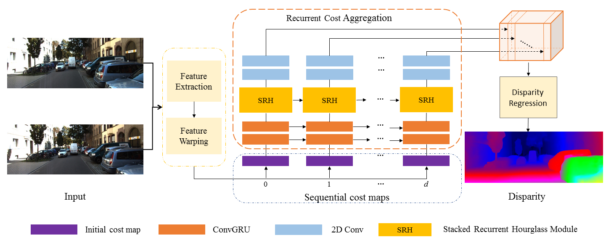

## SRH-Net: Stacked Recurrent Hourglass

### Introduction

This repository is supplementary material of our RA-L submission, which helps reviewers to understand and evaluate the submitted paper. The final version will be released to the community in the future.

 

For commercial purposes, please contact the authors: duhz@tju.edu.cn. If you use PlanarSLAM in an academic work, please cite:
```
inproceedings{dusrhnet,
  author = {Hongzhi Du, Yanyan Li, Yanbiao Sun, Jigui Zhu and Federico Tombari},
  title = {SRH-Net: Stacked Recurrent Hourglass Network for Stereo Matching},
  year = {2021},
  booktitle = {arXiv preprint arXiv:2105.11587},
 }
```

### Installation

We suggest to create an  Anaconda environment and install the dependencies:

```
conda create -y -n SRHNET python=3.6
conda activate SRHNET
pip install -r requirements.txt
```

-----

### Evaluation on the public datasets 

Please download the SceneFLow dataset: "FlyingThings3D", "Driving" and "Monkaa" (clean pass and disparity files).

```
  -mv all training images (totallty 29 folders) into ${your dataset PATH}/frames_cleanpass/TRAIN/
  -mv all corresponding disparity files (totallty 29 folders) into ${your dataset PATH}/disparity/TRAIN/
  -make sure the following 29 folders are included in the "${your dataset PATH}/disparity/TRAIN/" and "${your dataset PATH}/frames_cleanpass/TRAIN/":
    
    15mm_focallength	35mm_focallength		A			 a_rain_of_stones_x2		B				C
    eating_camera2_x2	eating_naked_camera2_x2		eating_x2		 family_x2			flower_storm_augmented0_x2	flower_storm_augmented1_x2
    flower_storm_x2	funnyworld_augmented0_x2	funnyworld_augmented1_x2	funnyworld_camera2_augmented0_x2	funnyworld_camera2_augmented1_x2	funnyworld_camera2_x2
    funnyworld_x2	lonetree_augmented0_x2		lonetree_augmented1_x2		lonetree_difftex2_x2		  lonetree_difftex_x2		lonetree_winter_x2
    lonetree_x2		top_view_x2			treeflight_augmented0_x2	treeflight_augmented1_x2  	treeflight_x2	

download and extract kitti and kitti2015 datasets.
```

#### Evaluation and Prediction 

Revise parameter settings and run "myevalution.sh" and "predict.sh" for evaluation and prediction on the SceneFLow dataset and KITTI datasets. Note that the “crop_width” and “crop_height” must be multiple of 16, "max_disp" must be multiple of 4 (default: 192).  

-------

### Test on your own stereo images


The repo provides the [pretrained model](https://drive.google.com/file/d/1Io_UVv0g6mg1LjkwQHCsEr2xoTaBmbKi/view?usp=sharing) for testing. Please extract the .zip file into *SRHNet Folder* and use the following command to test your stereo images.

```
python test_img.py --crop_height= image height\
                   --crop_width= image width\
                   --max_disp=192\
                   --leftimg='path/to/left/image'\
                   --rightimg='path/to/left/image'\
                   --resume='path/to/pretrained/model'
```

As an example, we also provide stereo images that can be tested by using the following command,

```
python test_img.py --crop_height=384\
                   --crop_width=1248\
                   --max_disp=192\
                   --leftimg='./demo/left12_10.png'\
                   --rightimg='./demo/right12_10.png'\
                   --resume='./finetune2_kitti2015_epoch_8.pth'
```
